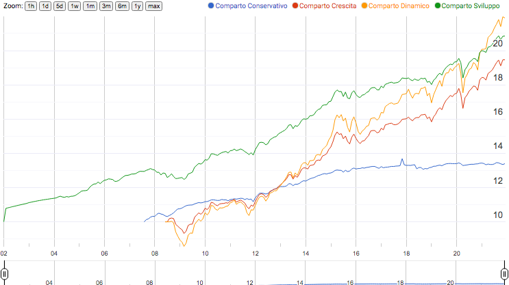

# Fon.Te. Share Values Scraper

tl;dr I scraped Fon.Te. share values so that you don't have to.

## Quick Links
- Google Sheet: [[PUBLIC] FonTe - Valori Quota](https://docs.google.com/spreadsheets/d/1c5C-6Ir997is-bw84fqNfvU-AkJUYeC36zY6Sv23SXE/edit?usp=sharing)
- CSV: [[PUBLIC] FonTe - Valori Quota](https://docs.google.com/spreadsheets/d/1c5C-6Ir997is-bw84fqNfvU-AkJUYeC36zY6Sv23SXE/export?gid=1638616084&format=csv) 
- TSV: [[PUBLIC] FonTe - Valori Quota](https://docs.google.com/spreadsheets/d/1c5C-6Ir997is-bw84fqNfvU-AkJUYeC36zY6Sv23SXE/export?gid=1638616084&format=tsv)
- Chart Example (click to open in a new tab) 

## Description
[Fon.Te.](https://www.fondofonte.it/) share values for all 4 _compartments_ are available in the following pages:
- [Valori Quota: Comparto Garantito](https://www.fondofonte.it/gestione-finanziaria/i-valori-quota-dei-comparti/comparto-garantito/)
- [Valori Quota: Comparto Bilanciato](https://www.fondofonte.it/gestione-finanziaria/i-valori-quota-dei-comparti/comparto-bilanciato/)
- [Valori Quota: Comparto Crescita](https://www.fondofonte.it/gestione-finanziaria/i-valori-quota-dei-comparti/comparto-crescita/)
- [Valori Quota: Comprato Dinamico](https://www.fondofonte.it/gestione-finanziaria/i-valori-quota-dei-comparti/comparto-dinamico/)

In this form they are hardly usable. This is my attempt to fix that:
- in this repo you can find a parser to extract quotes from the web pages and save them to Google Sheet
- I compared public quotes with what I can see in FonTe customer's portal and fixed a few errors in public numbers
- you can find the resulting data in the [Quick Links](#quick-links) above.
 

## Known issues
- For simplicity's sake, the dataset always shows the last day of each month, even if the market was closed on such days (e.g. it was a Sunday).
- There is some discrepancy between quotes coming from FonTe's [public pages](https://www.fondofonte.it/gestione-finanziaria/i-valori-quota-dei-comparti/comparto-dinamico/) and those you can access when logged in the platform (for customers only). In such cases, quotes from the platform overwrite public values. For a list of known discrepancies, see comments in the definition of the `fix_errors()` function.

  